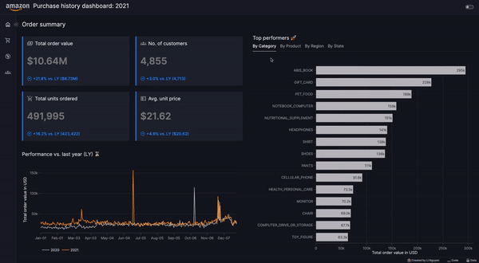

# 🌞 Dash summer app challenge 2024

This is my entry for the [Dash summer app challenge 2024](https://community.plotly.com/t/summer-dash-app-building-challenge-amazon-purchases/84396)
where I have visualized Amazon purchase history data.

**Note:** The dashboard focuses on data from 2021 only. Observations with missing product information have been removed for the purpose of the analysis.

The dashboard showcases how purchase data can be visualized and is divided into four main pages:

- **Purchase Overview:** Displays key metrics and top performers across four major categories (product category, product items, region, states), with year-to-year comparisons.
- **Product Overview:** Highlights the top N best-performing products, allowing users to explore the product hierarchy and identify seasonal patterns. Users can also select the top N for more detailed analysis.
- **Regional Overview:** Provides a regional comparison of key metrics and top performers across the four major categories. Users can drill down from region to states to analyze product performance regionally.
- **Customer Overview:** Compares various key metrics across different socio-economic categories (e.g., age group, education, income group).

**Created by:** [Huong Li Nguyen](https://github.com/huong-li-nguyen)

---

### 🗓️ Data

A special thanks to the authors mentioned below for supplying the data set. The original data set can be accessed
[here](https://dataverse.harvard.edu/dataset.xhtml?persistentId=doi:10.7910/DVN/YGLYDY#).

- **Authors**: Alex Berke and Dan Calacci and Robert Mahari and Takahiro Yabe and Kent Larson and Sandy Pentland
- **Publisher**: Harvard Dataverse
- **Title**: Open e-commerce 1.0: Five years of crowdsourced U.S. Amazon purchase histories with user demographics
- **Publisher**: Harvard Dataverse
- **Year**: 2023
- **Version**: V1
- **URL**: https://doi.org/10.7910/DVN/YGLYDY

### 📊 Plotly/Dash resources

- [Bar charts](https://plotly.com/python/bar-charts/)
- [Line charts](https://plotly.com/python/line-charts/)
- [Density heatmap](https://plotly.com/python/heatmaps/)
- [Choropleth maps](https://plotly.com/python/choropleth-maps/)
- [Dash AgGrid](https://dash.plotly.com/dash-ag-grid)

### 🚀 Vizro features applied

- [Vizro tutorial on pages, layouts and dashboards](https://vizro.readthedocs.io/en/stable/pages/tutorials/explore-components/)
- [Graphs](https://vizro.readthedocs.io/en/stable/pages/user-guides/graph/)
- [Tables](https://vizro.readthedocs.io/en/stable/pages/user-guides/table/)
- [KPI cards](https://vizro.readthedocs.io/en/stable/pages/user-guides/figure/)
- [Actions](https://vizro.readthedocs.io/en/stable/pages/user-guides/actions/)
- [Custom components](https://vizro.readthedocs.io/en/stable/pages/user-guides/custom-components/)
- [Custom charts](https://vizro.readthedocs.io/en/stable/pages/user-guides/custom-charts/)
- [Custom CSS](https://vizro.readthedocs.io/en/stable/pages/user-guides/assets/)

### 🖥️ App demo

---

## How to run the example locally

1. Install the `requirements.txt` in your environment.
2. Download the data `survey.csv` and `amazon-purchases.csv` from [here](https://dataverse.harvard.edu/dataset.xhtml?persistentId=doi:10.7910/DVN/YGLYDY#) and place it in a folder called `data`.
3. Run the `app.py` file with your environment activated.
4. You should now be able to access the app locally via http://127.0.0.1:8050/.
