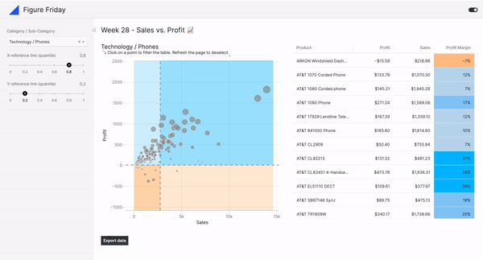

# Figure Friday - Week 28

## 📑 Sources 

### 🗓️ FigureFriday
- FigureFriday - Week 28: https://community.plotly.com/t/figure-friday-2024-week-28/84980

### 🚀 Vizro Features applied
- Vizro tutorial on pages, layouts and dashboards: https://vizro.readthedocs.io/en/stable/pages/tutorials/explore-components/
- Custom charts: https://vizro.readthedocs.io/en/stable/pages/user-guides/custom-charts/
- Chart interactions: https://vizro.readthedocs.io/en/stable/pages/user-guides/actions/#filter-data-by-clicking-on-chart

### 🖥️ App Demo

☕ **Hosted on PyCafe:** https://py.cafe/huong-li-nguyen/figure-friday-week-28
