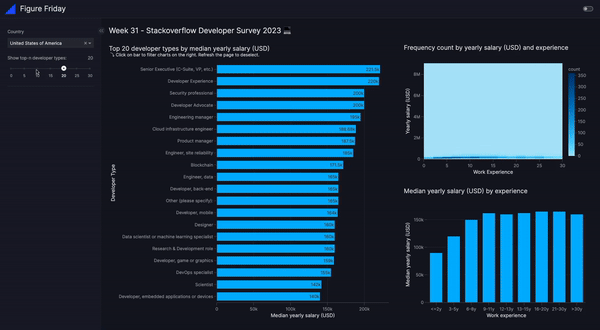

# Figure Friday - Week 31

## 📑 Sources 

### 🗓️ FigureFriday
- FigureFriday - Week 31: https://community.plotly.com/t/figure-friday-2024-week-31/86264
- Data Source: https://survey.stackoverflow.co/

### 🚀 Vizro Features applied
- Vizro tutorial on pages, layouts and dashboards: https://vizro.readthedocs.io/en/stable/pages/tutorials/explore-components/
- Custom charts: https://vizro.readthedocs.io/en/stable/pages/user-guides/custom-charts/
- Chart interactions: https://vizro.readthedocs.io/en/stable/pages/user-guides/actions/#filter-data-by-clicking-on-chart

### 🖥️ App Demo

To run the app locally:

1. Install the `requirements.txt` file
2. Download the 2023 data from [the stackoverflow survey](https://survey.stackoverflow.co/) and place it into the `figure-friday-week31` folder
3. Run the app with `python app.py`
