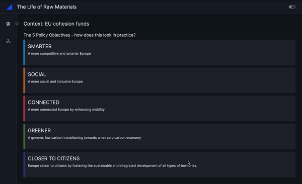

# MakeOverMonday - Week 13

## 📑 Sources 

### 🗓️ MakeOverMonday
- MakeOverMonday: https://makeovermonday.co.uk/
- Data Source: https://data.world/makeovermonday/the-life-of-raw-materials-in-amsterdam
- Original Article: https://data.europa.eu/en/publications/datastories/open-data-enabler-regional-development-and-better-cohesion-europe
- EU regional and urban development: https://ec.europa.eu/regional_policy/policy/how/priorities_en

### 📊 Plotly Resources 
- Sankey Chart: https://plotly.com/python/sankey-diagram/
- Deep Dive on Sankey Diagrams: https://plotly.com/blog/sankey-diagrams/

### 🚀 Vizro Features applied
- Vizro tutorial on pages, layouts and dashboards: https://vizro.readthedocs.io/en/stable/pages/tutorials/explore-components/
- Custom charts: https://vizro.readthedocs.io/en/stable/pages/user-guides/custom-charts/
- Custom tables: https://vizro.readthedocs.io/en/stable/pages/user-guides/custom-tables/
- Custom navigation: https://vizro.readthedocs.io/en/stable/pages/user-guides/navigation/
- Custom CSS: https://vizro.readthedocs.io/en/stable/pages/user-guides/assets/

### 🖥️ App Demo

