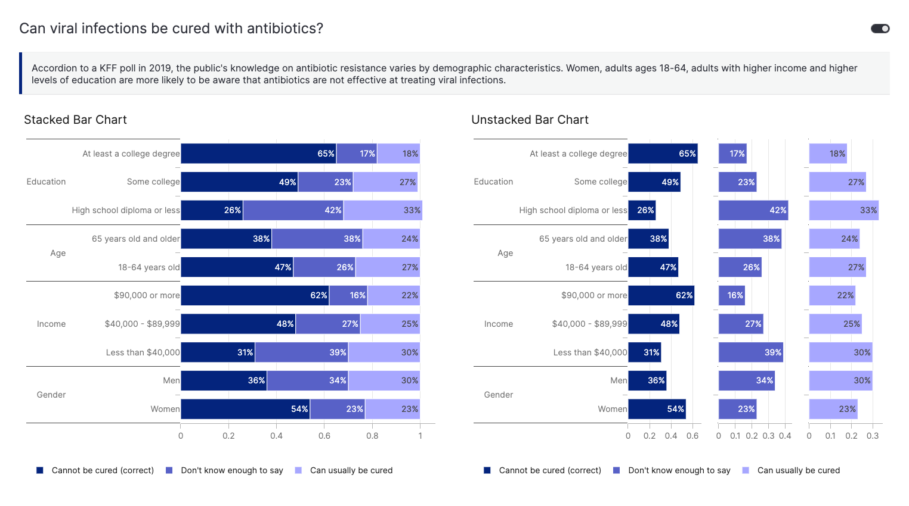

# MakeOverMonday - Week 13

## 📑 Sources 

### 🗓️ MakeOverMonday
- MakeOverMonday: https://makeovermonday.co.uk/
- Data Source: https://data.world/makeovermonday/2024w14-public-awareness-around-antibiotic-resistance
- Original Article: https://www.kff.org/other/issue-brief/data-note-public-awareness-antibiotic-resistance/

### 📊 Plotly Resources 
- Bar Chart: https://plotly.com/python-api-reference/generated/plotly.graph_objects.Bar.html
- Tutorial on bar charts: https://plotly.com/python/bar-charts/
- Multi-categorical axes: https://plotly.com/python/categorical-axes/#multicategorical-axes
- Subplots: https://plotly.com/python/subplots/

### 🚀 Vizro Features applied
- Vizro tutorial on pages, layouts and dashboards: https://vizro.readthedocs.io/en/stable/pages/tutorials/explore-components/
- Custom charts: https://vizro.readthedocs.io/en/stable/pages/user-guides/custom-charts/
- Custom CSS: https://vizro.readthedocs.io/en/stable/pages/user-guides/assets/

### 🖥️ App Demo

